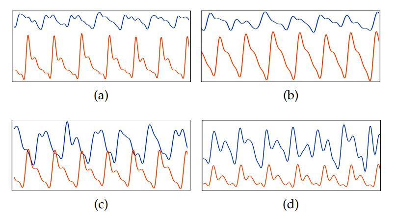

# Touch-CPG-Dataset (Content in progress)

## Overview

This dataset includes the touchscreen output (raw CPG records) and PPG data collected simultaneously.

We recruited 16 volunteers between 22 and 46 years of age.All volunteers are healthy and have no experience with CPGbased biometrics. They had an average heart rate between 56 and 102 BPM, with an average of 79 BPM.

An overview of the CPG dataset is as follow .Listed in the table are the number of sessions, the total duration of each subject’s CPG data.

|SubjectID | Session | Duration(min) | Valid Samples|
| :--- | :-- | :-- | :--| 
| S01 | 20 | 41.60 | 1635 |
|S02| 26| 53.82| 2051|
|S03| 24| 50.16| 1796|
|S04| 23| 48.07| 1406|
|S05| 26| 54.08| 2034|
|S06 |22 |45.76 | 1679|
|S07| 30| 62.40| 2360|
|S08 |30 |62.40 |2312|
|S09| 26| 54.08| 2098|
|S10 |20 |42.00 |1600|
|S11| 21| 43.68| 1401|
|S12 |22 |45.54 |1746|
|S13| 27 |56.43| 2040|
|S14 |30 |62.10 |2561|
|S15| 20| 42.00| 1605|
|S16 |21| 44.10 |1747|
|Total|388|809.27|30071|

The heartbeat periodicity of CPG is roughly consistent with the finger PPG, but there are significant differences in morphology . The main reason is that the basic noise of the touchscreen is unstable and quite large for CPG signals.Comparison between CPG with PPG for different individuals are as follow. The blue waves are CPG, and the red ones are PPG.

## Contact
Jinxiao Wu (wujx16@mails.tsinghua.edu.cn), Department of Automation, Tsinghua University

## Privacy

Before the experiment, the volunteers had carefully read and signed the informed consent form approved by the Ethics Committee of the Department of Psychology of Tsinghua University . And then, a five-minute brief introduction was given to each participant, including the use of the APP and the protocol of the data collection. When disclosing the dataset, we strictly protect the personal privacy information of the collected person, including personal identity information, contact information and other sensitive information.

## Download
- This database is released to universities and research institutes for research purpose only.
- Note that please contact wujx16@mails.tsinghua.edu.cn (or luyq@tsinghua.edu.cn) for requests using an official email address (that is, university or institute email address, and non-official email addresses such as Gmail and 163 are not acceptable). When we receive your reply, we would provide the download link to you.

